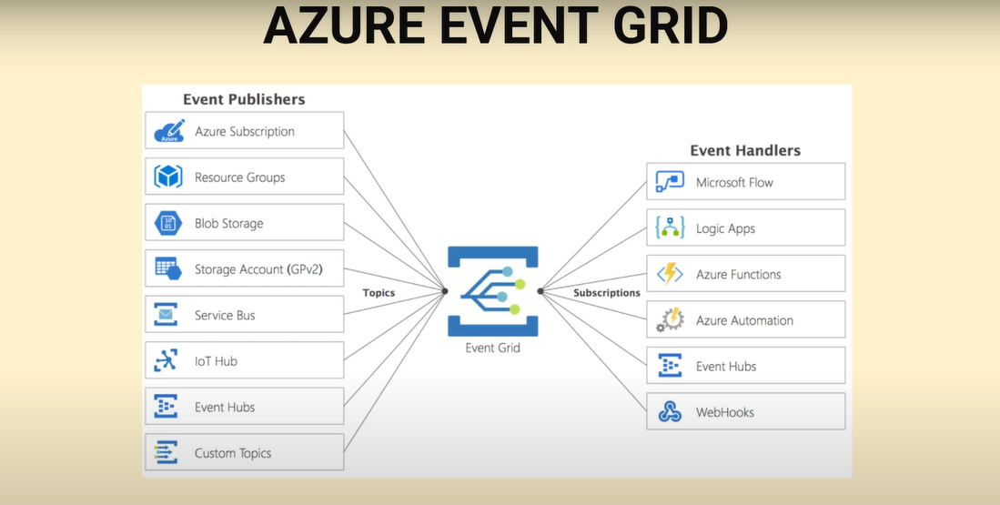
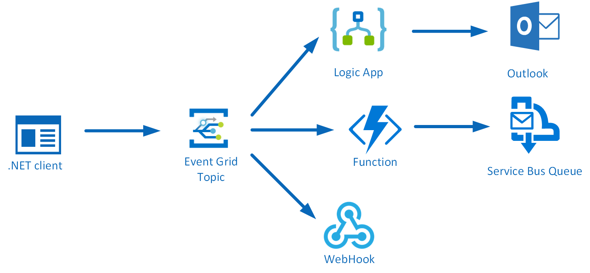
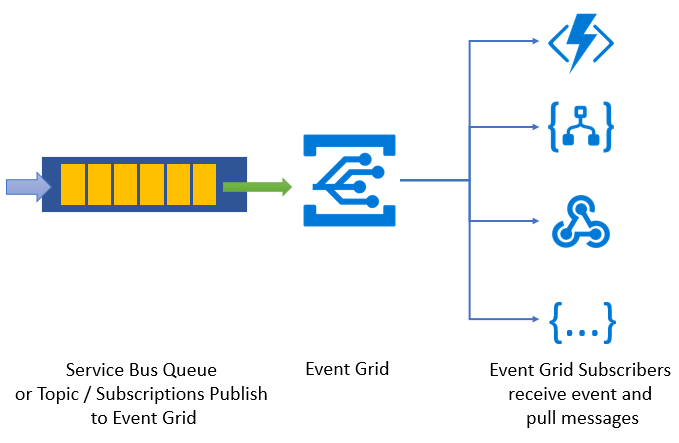
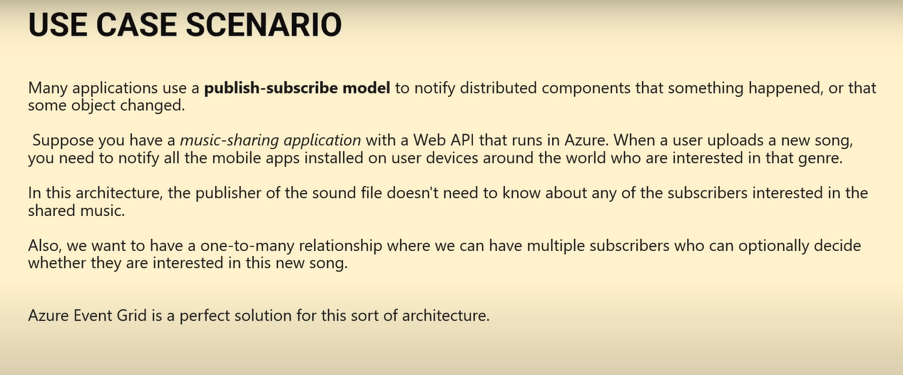

# QUESTIONS :

## What Is Azure Event Grid?

Azure Event Grid is a **centralized event routing service** in Azure that enables seamless communication between event publishers and subscribers. It follows the **Publish-Subscribe (Pub/Sub) model**, allowing you to build event-based, reactive applications easily.

- **Centralized Event Routing:** Efficiently routes events from various Azure services or custom sources to event handlers.
- **Publish-Subscribe Model:** Decouples event producers from event consumers, enabling scalable and loosely coupled architectures.
- **High Availability and Reliability:** Built to handle massive scale with low latency and built-in retry mechanisms.

## Core Concepts

### Topics

A **Topic** in Azure Event Grid is a user-defined endpoint where event publishers send their events. It acts as a routing hub that organizes and delivers events to subscribers.

- **Custom Topics:** Create your own topics for custom event publishing.
- **Event Publishers:** Send events to a specific topic.
- **Multiple Subscribers:** Multiple handlers can subscribe to one topic.
- **Decoupling:** Topics help decouple event producers and consumers for flexible design.

> **Note:** Azure also provides **System Topics** automatically created for some Azure services to publish events without manual topic management.

### Event Subscription

An **Event Subscription** connects a topic to an event handler (subscriber). It defines where events should be delivered and can include filters to select specific events.

- Supports multiple endpoint types (Azure Functions, Logic Apps, Webhooks, etc.)
- Enables event filtering and dead-lettering for reliable delivery.

### Event Schema

Azure Event Grid events use a consistent schema based on the CloudEvents specification, making integration with different services and custom applications simple.

- ***Follow Link for Schema:*** (https://learn.microsoft.com/en-us/azure/event-grid/event-schema)

## Benefits of Azure Event Grid

- **Scalable & Serverless:** Automatically handles millions of events per second.
- **Low Latency:** Near real-time event delivery.
- **Flexible Routing:** Supports complex routing and filtering rules.
- **Built-in Reliability:** Retry policies and dead-letter queues.
- **Integration:** Works with Azure services like Azure Functions, Logic Apps, and custom endpoints.

## Example Use Case

1. An application uploads a file to Azure Blob Storage.
2. Blob Storage publishes an event to Event Grid Topic.
3. Event Grid routes the event to an Azure Function that processes the file.f

## References

- [Azure Event Grid Documentation](https://learn.microsoft.com/en-us/azure/event-grid/)
- [Azure Event Grid Pricing](https://azure.microsoft.com/en-us/pricing/details/event-grid/)
